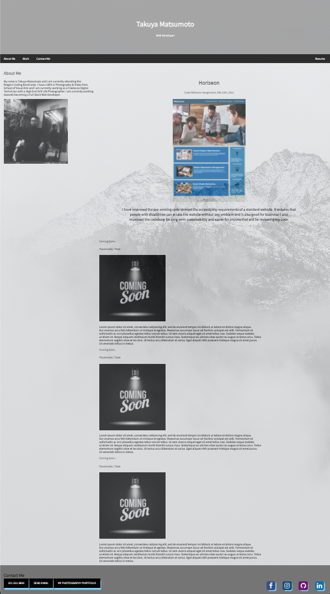

# My-Portfolio

1. [ Overview. ](#overview)
2. [ Web Address. ](#web-address)
3. [ Usage tips. ](#usage)
4. [ Credits. ](#credits)
5. [ Sources. ](#sources)
6. [ License. ](#license)

## 1. Overview

### This is Takuya Matsumoto's basic html/css Portfolio Web Page

Desktop screen:

Smaller devices screen example:

## 2. How to Get There

### Click link to open in your browser.

[github pages site] https://takuyamats.github.io/My-Portfolio/

[github repository site] https://github.com/TakuyaMats/My-Portfolio.git

## 3. Usage Tips

### Use the controls on the top to visit the different sections of the web page.

Desktop screen:

Smaller devices screen example:

### View the rest of my page by scrolling up or down.

Desktop screen:

## 4. Credits

Ben Durham: [https://github.com/bdurham227]

Jason Babanel: [https://github.com/Jbarbss]

Gabe Thomas: [https://github.com/samohtebag]

Patrick Walker: [https://github.com/pat31477]

## 5. Sources

## For the button Links in the Contact Me Section
- https://css-tricks.com/css-basics-styling-links-like-boss/
## For mostly template ideas, box model, styling css, Social Media Buttons
- https://www.w3schools.com/
## Background Image
- https://unsplash.com/@z734923105

## 6. License

MIT License

Copyright (c) [2021] [Takuya Matsumoto]

Permission is hereby granted, free of charge, to any person obtaining a copy of this software and associated documentation files (the "Software"), to deal in the Software without restriction, including without limitation the rights to use, copy, modify, merge, publish, distribute, sublicense, and/or sell copies of the Software, and to permit persons to whom the Software is furnished to do so, subject to the following conditions:

The above copyright notice and this permission notice shall be included in all copies or substantial portions of the Software.

THE SOFTWARE IS PROVIDED "AS IS", WITHOUT WARRANTY OF ANY KIND, EXPRESS OR IMPLIED, INCLUDING BUT NOT LIMITED TO THE WARRANTIES OF MERCHANTABILITY, FITNESS FOR A PARTICULAR PURPOSE AND NONINFRINGEMENT. IN NO EVENT SHALL THE AUTHORS OR COPYRIGHT HOLDERS BE LIABLE FOR ANY CLAIM, DAMAGES OR OTHER LIABILITY, WHETHER IN AN ACTION OF CONTRACT, TORT OR OTHERWISE, ARISING FROM, OUT OF OR IN CONNECTION WITH THE SOFTWARE OR THE USE OR OTHER DEALINGS IN THE SOFTWARE.
