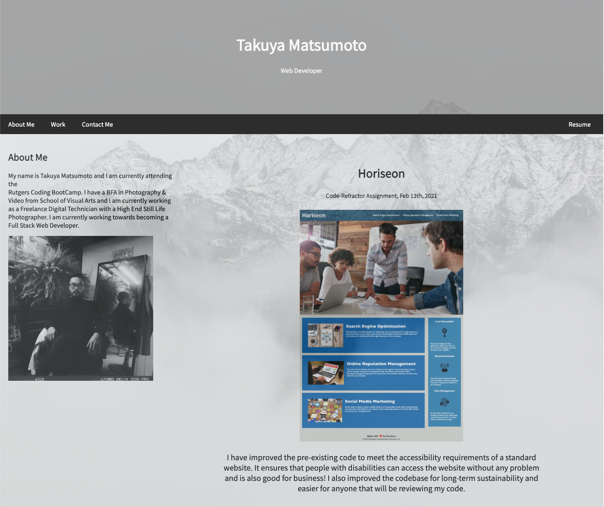
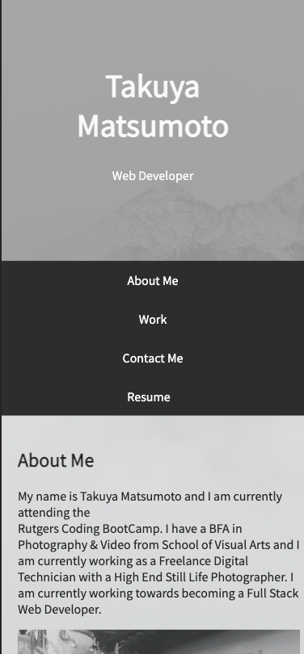
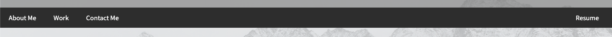
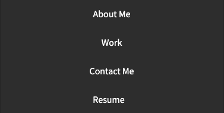

# My-Portfolio

1. [ Description. ](#desc)
2. [ Web Address. ](#web-address)
3. [ Usage tips. ](#usage)
4. [ Contributions. ](#contributions)

## 1. Description

### This is Takuya Matsumoto's basic html/css Portfolio Web Page

Desktop screen:

Smaller devices screen example:

## 2. How to Get There

### Click link to open in your browser.

[github pages site] https://github.com/TakuyaMats/My-Portfolio.git

[github repository site] https://takuyamats.github.io/My-Portfolio/

## 3. Usage Tips

### Use the controls in the top right to visit the different sections of the web page.

Desktop screen:

Smaller devices screen example:

### View the rest of my page by scrolling up or down.

Desktop screen:

Smaller devices screen example:

## 4. Contributions

Ben Durham: [https://github.com/bdurham227]

Jason Babanel: [https://github.com/Jbarbss]

Gabe Thomas: [https://github.com/samohtebag]

Patrick Walker: [https://github.com/pat31477]
